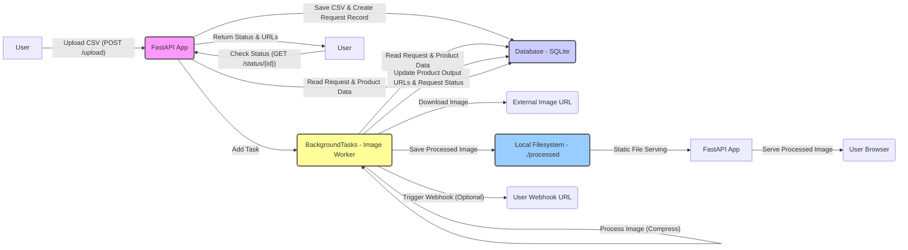

# Image Processing API

A FastAPI service for processing product images from CSV files asynchronously.

## Table of Contents
- [Features](#features)
- [Low-Level Design (LLD)](#low-level-design-lld)
  - [System Diagram](#system-diagram)
  - [Component Descriptions](#component-descriptions)
  - [Database Schema](#database-schema)
- [API Documentation](#api-documentation)
  - [Upload CSV](#upload-csv)
  - [Check Status](#check-status)
- [Asynchronous Worker](#asynchronous-worker)
- [Setup](#setup)
- [Testing](#testing)
  - [Sample CSV](#sample-csv)
  - [Upload Command](#upload-command)
  - [Status Check Command](#status-check-command)
- [Postman Collection](#postman-collection)

## Features
- CSV upload with validation
- Asynchronous image processing (50% quality compression)
- Request status tracking
- Webhook notifications
- SQLite database storage

## Low-Level Design (LLD)

This section details the technical design of the image processing system.

### System Diagram (copy and open on mermaid.live)



### Component Descriptions

1.  **FastAPI Application (`app/main.py`)**:
    *   **Role:** The main web server handling incoming HTTP requests.
    *   **Function:**
        *   Provides API endpoints (`/upload`, `/status/{request_id}`).
        *   Manages request routing to specific handler functions.
        *   Initializes the database connection and creates tables.
        *   Uses `BackgroundTasks` to delegate long-running image processing tasks.
        *   Serves processed images as static files from the `./processed` directory via the `/processed` route.

2.  **Upload Router (`app/routers/upload.py`)**:
    *   **Role:** Handles the CSV file upload process.
    *   **Function:**
        *   Receives the POST request at `/upload`.
        *   Validates the file type (must be `.csv`).
        *   Generates a unique `request_id`.
        *   Saves the uploaded CSV temporarily to the `./uploads` directory.
        *   Parses the CSV using the standard `csv` module, validating headers and row structure.
        *   Creates a `Request` record in the database with status `PENDING`.
        *   Creates `Product` records for each row in the CSV, storing the raw comma-separated `input_image_urls`.
        *   Adds the `process_images` function to `BackgroundTasks` with the `request_id`.
        *   Returns the `request_id` to the user immediately with a `202 Accepted` status.

3.  **Status Router (`app/routers/status.py`)**:
    *   **Role:** Handles requests to check the status of a processing job.
    *   **Function:**
        *   Receives GET requests at `/status/{request_id}`.
        *   Queries the database for the `Request` record matching the `request_id`.
        *   Queries the database for all associated `Product` records.
        *   Formats the response, splitting the comma-separated `input_image_urls` and `output_image_urls` strings into lists. Includes empty strings (`""`) in `output_image_urls` for images that failed processing.
        *   Returns the request status, timestamps, and product details.
        *   Includes the `trigger_webhook` utility function.

4.  **Image Processing Worker (`app/workers/image_processor.py`)**:
    *   **Role:** Performs the actual image downloading, processing, and saving in the background.
    *   **Function:**
        *   Executed via `BackgroundTasks`. Receives the `request_id`.
        *   Updates the request status to `PROCESSING`.
        *   Retrieves all `Product` records for the request.
        *   Iterates through each product:
            *   Splits the `input_image_urls` string into a list.
            *   Iterates through each input URL:
                *   Downloads the image using `requests`.
                *   Opens the image using `Pillow (PIL)`.
                *   Compresses the image to 50% quality.
                *   Saves the processed image locally to the `./processed` directory with a unique filename.
                *   Constructs the publicly accessible URL (using `PROCESSED_URL_BASE`, defaulting to `http://localhost:8000/processed/`).
                *   Appends the processed URL (or `None` on error) to a list.
            *   Joins the processed URLs list into a comma-separated string (converting `None` to `""`).
            *   Updates the `Product` record's `output_image_urls` field.
        *   Updates the request status to `COMPLETED` if all products processed without fatal errors.
        *   If any unhandled exception occurs during the entire process, updates the request status to `FAILED`.
        *   Calls `trigger_webhook` with the final status (`COMPLETED` or `FAILED`).

5.  **Database Interaction (`app/core/database.py`, `app/models/`)**:
    *   **Role:** Manages data persistence using SQLAlchemy and SQLite.
    *   **Function:**
        *   Defines the database engine and session management (`SessionLocal`).
        *   Defines SQLAlchemy models (`Request`, `Product`) mapping to database tables.
        *   Stores request details (ID, status, timestamps, webhook URL).
        *   Stores product details (serial number, name, input/output URL strings) linked to a request.

6.  **Webhook Handling (`trigger_webhook` in `app/routers/status.py`)**:
    *   **Role:** Notifies an external system upon completion or failure of a request.
    *   **Function:**
        *   Called by the worker (`process_images`) at the end of processing.
        *   Retrieves the `Request` record to get the optional `webhook_url`.
        *   If a `webhook_url` exists, sends a POST request to that URL with a JSON payload containing the `request_id` and final `status`.
        *   Uses a simple `requests.post` call (Note: In a production system, consider using background tasks or a message queue for more robust webhook delivery).

### Database Schema (using sqlite3 for now, as this is also ACID complied DB)

*   **requests** table:
    *   `request_id` (String, Primary Key): Unique identifier for the upload request.
    *   `status` (String Enum - PENDING, PROCESSING, COMPLETED, FAILED): Current status of the request.
    *   `webhook_url` (String, Nullable): Optional URL for webhook notification.
    *   `created_at` (DateTime): Timestamp when the request was created.
    *   `updated_at` (DateTime): Timestamp when the request was last updated.
*   **products** table:
    *   `id` (Integer, Primary Key): Auto-incrementing ID for the product record.
    *   `request_id` (String, ForeignKey -> requests.request_id): Links the product to its request.
    *   `serial_number` (String): Serial number from the CSV.
    *   `product_name` (String): Product name from the CSV.
    *   `input_image_urls` (String): Comma-separated string of input image URLs from the CSV.
    *   `output_image_urls` (String): Comma-separated string of processed image URLs (or empty strings for failures).

## API Documentation

### Upload CSV
`POST /upload`

Uploads a CSV file containing product and image URL data for asynchronous processing.

**Request Body:**
- `file`: The CSV file to upload (multipart/form-data).
- `webhook_url` (optional form field): A URL to send a POST request to upon completion or failure of the processing job.

**CSV Format:**
```csv
S. No.,Product Name,Input Image Urls
1,SKU1,"https://example.com/image1.jpg,https://example.com/image2.jpg"
2,SKU2,https://example.com/image3.jpg
```
*   **S. No.:** Serial number or identifier for the product.
*   **Product Name:** Name of the product.
*   **Input Image Urls:** Comma-separated list of public URLs for the product's images. If a single cell contains multiple URLs, they should ideally be enclosed in double quotes, but the parser attempts to handle unquoted commas as well.

**Success Response (202 Accepted):**
```json
{
  "request_id": "c7dedf37-5059-4e44-8798-152c21b158e8"
}
```

**Error Responses:**
- `400 Bad Request`: Invalid file type (not CSV), invalid CSV header, invalid row format, missing data in a row.
- `500 Internal Server Error`: Database error or other unexpected server issue during upload/parsing.

### Check Status
`GET /status/{request_id}`

Retrieves the current status and processing results for a given request ID.

**Path Parameters:**
- `request_id` (string, required): The unique ID returned by the `/upload` endpoint.

**Success Response (200 OK):**
```json
{
  "request_id": "c7dedf37-5059-4e44-8798-152c21b158e8",
  "status": "COMPLETED", // Can be PENDING, PROCESSING, COMPLETED, FAILED
  "created_at": "2025-03-29T04:54:09.449101", // ISO 8601 format
  "updated_at": "2025-03-29T04:54:15.945334", // ISO 8601 format
  "products": [
    {
      "serial_number": "1", // Note: Stored as String now
      "product_name": "Test Product 1",
      "input_image_urls": [
        "https://picsum.photos/200/300",
        "https://picsum.photos/400/600"
      ],
      "output_image_urls": [
        "http://localhost:8000/processed/698b97f7-f6e0-48f7-b1a3-0a89c8f6f8d4.jpeg",
        "http://localhost:8000/processed/e8948402-f73b-4db9-be0f-6acbaec91b43.jpeg"
      ]
    },
    {
      "serial_number": "2", // Note: Stored as String now
      "product_name": "Test Product 2",
      "input_image_urls": [
        "https://picsum.photos/800/1200"
      ],
      "output_image_urls": [
        // Example if processing failed for this image:
        ""
        // Example if processing succeeded:
        // "http://localhost:8000/processed/058a2ac5-a160-4bdc-9de1-3b34c233616a.jpeg"
      ]
    }
  ]
}
```
*   `output_image_urls` contains a list of strings. An empty string `""` at a specific index indicates that the processing failed for the corresponding input image URL at the same index.

**Error Responses:**
- `404 Not Found`: The provided `request_id` does not exist.
- `500 Internal Server Error`: Database error or other unexpected server issue during status retrieval.

## Asynchronous Worker

The image processing logic resides in `app/workers/image_processor.py` within the `process_images` function.

**Function:** `process_images(request_id: str)`
*   **Trigger:** Called via `BackgroundTasks` from the `/upload` endpoint.
*   **Steps:**
    1.  Sets the request status to `PROCESSING`.
    2.  Fetches all products associated with the `request_id`.
    3.  Loops through each product and its input URLs.
    4.  For each URL:
        *   Downloads the image.
        *   Compresses it using Pillow (50% quality).
        *   Saves it to the `./processed` directory.
        *   Generates the output URL (using `PROCESSED_URL_BASE` env var or default).
        *   Handles errors during download/processing, marking the specific image as failed (`None`, later converted to `""`).
    5.  Updates the `output_image_urls` field in the database for the product.
    6.  After processing all products, sets the request status to `COMPLETED`.
    7.  If any unrecoverable error occurs during the overall process, sets status to `FAILED`.
    8.  Calls `trigger_webhook` with the final status.

## Setup

1. Install dependencies:
```bash
pip install -r requirements.txt
```

2. Run the server:
```bash
uvicorn app.main:app --reload
```

3. The API will be available at `http://localhost:8000`

## Testing

1. Create a test CSV file (sample.csv):
```csv
S. No.,Product Name,Input Image Urls
1,TestProduct,https://example.com/image1.jpg,https://example.com/image2.jpg
```

2. Upload the file:
```bash
curl -X POST -F "file=@sample.csv" http://localhost:8000/upload
```

3. Check status:
```bash
curl http://localhost:8000/status/your-request-id
```

## Postman Collection

You can import the following JSON into Postman to test the API endpoints:

```json
{
	"info": {
		"_postman_id": "d7aef37c-5c21-47a8-bbe9-ab0d1a413249",
		"name": "Image Processing API",
		"schema": "https://schema.getpostman.com/json/collection/v2.1.0/collection.json",
		"_exporter_id": "36914560"
	},
	"item": [
		{
			"name": "Upload CSV",
			"request": {
				"method": "POST",
				"header": [],
				"body": {
					"mode": "formdata",
					"formdata": [
						{
							"key": "file",
							"type": "file",
							"src": []
						},
						{
							"key": "webhook_url",
							"value": "https://your-webhook-listener.com/endpoint",
							"type": "text",
							"disabled": true
						}
					]
				},
				"url": {
					"raw": "{{baseUrl}}/upload",
					"host": [
						"{{baseUrl}}"
					],
					"path": [
						"upload"
					]
				},
				"description": "Upload a CSV file for image processing. Select your CSV file for the 'file' key. Optionally enable and set the 'webhook_url'."
			},
			"response": []
		},
		{
			"name": "Check Status",
			"request": {
				"method": "GET",
				"header": [],
				"url": {
					"raw": "{{baseUrl}}/status/{{requestId}}",
					"host": [
						"{{baseUrl}}"
					],
					"path": [
						"status",
						"{{requestId}}"
					]
				},
				"description": "Check the processing status using the request ID obtained from the Upload CSV endpoint. Set the `requestId` variable in Postman."
			},
			"response": []
		}
	],
	"event": [
		{
			"listen": "prerequest",
			"script": {
				"type": "text/javascript",
				"exec": [
					""
				]
			}
		},
		{
			"listen": "test",
			"script": {
				"type": "text/javascript",
				"exec": [
					""
				]
			}
		}
	],
	"variable": [
		{
			"key": "baseUrl",
			"value": "http://localhost:8000",
			"type": "default"
		},
		{
			"key": "requestId",
			"value": "PASTE_YOUR_REQUEST_ID_HERE",
			"type": "default"
		}
	]
}
```
